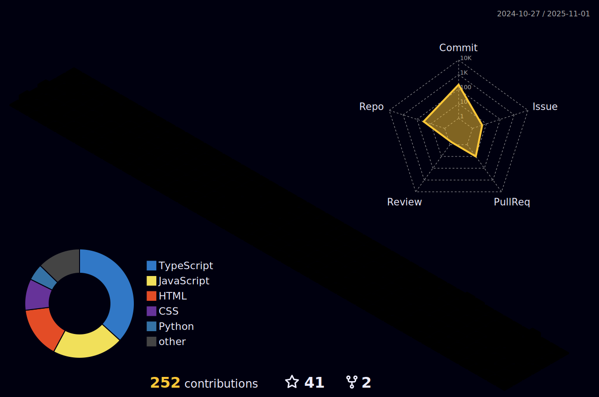

# 👋 Olá! Eu sou Tiago Bettega

## 🚀 Desenvolvedor Web Full Stack

Desenvolvedor Web Full Stack apaixonado por tecnologia, com experiência sólida na criação de soluções digitais escaláveis e inovadoras. Especializado em desenvolvimento backend e frontend, com foco em arquiteturas robustas e experiência do usuário excepcional.

---

## 💻 Stack Tecnológica

### Linguagens de Programação


### Frameworks & Tecnologias


---

## 🎯 Áreas de Especialização

- **🔧 Desenvolvimento Backend**: APIs RESTful, microserviços e arquiteturas escaláveis
- **🎨 Desenvolvimento Frontend**: Interfaces responsivas e experiência do usuário
- **🗄️ Banco de Dados**: Modelagem, otimização e administração
- **📊 Análise de Dados**: Extração de insights e relatórios inteligentes
- **☁️ DevOps**: Deploy, CI/CD e infraestrutura como código

---

## 📈 GitHub Stats



<div align="center">
  
  
</div>

---

## 🌟 Sobre Mim

```php
<?php

class TiagoBettega extends Developer
{
    public function getCurrentFocus(): array
    {
        return [
            'backend' => ['PHP/Laravel', 'Python', 'C#/.NET'],
            'frontend' => ['JavaScript', 'HTML5', 'CSS3'],
            'database' => ['MySQL', 'PostgreSQL', 'MongoDB'],
            'tools' => ['Git', 'Docker', 'Linux'],
            'learning' => ['Cloud Computing', 'Microservices', 'AI/ML']
        ];
    }

    public function getGoals(): string
    {
        return 'Criar soluções que impactem positivamente a vida das pessoas';
    }
}
```

---

## 📫 Vamos Conectar?

[](https://linkedin.com/in/tiagobettega)
[](https://tago.zip)

---

<div align="center">
  
</div>

<div align="center">
  <h3>💡 "Código limpo não é escrito seguindo regras. É escrito por programadores que se importam." - Robert C. Martin</h3>
</div>